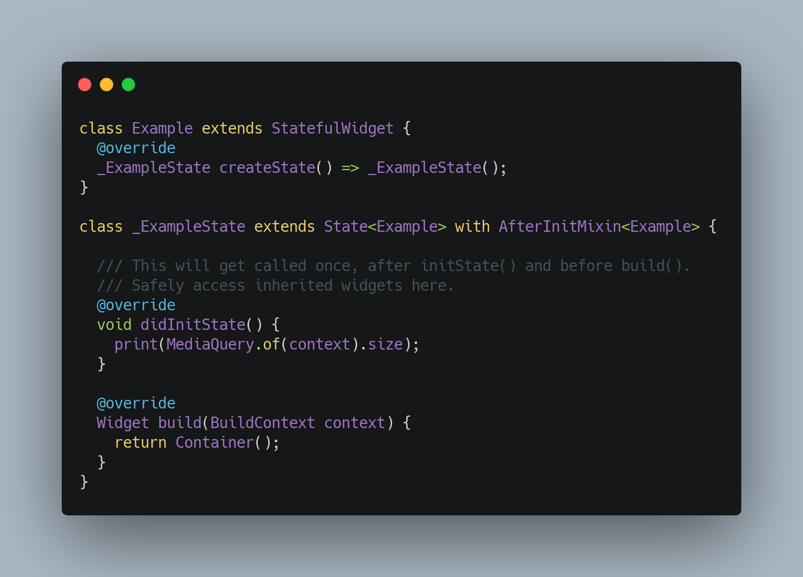

# after_init

Adds a `didInitState()` lifecycle method to stateful widgets where you can safely access inherited widgets.



[InheritedWidget](https://api.flutter.dev/flutter/widgets/InheritedWidget-class.html) is heavily used throughout the Flutter framework. Many state management packages such as [ScopedModel](https://pub.dev/packages/scoped_model) and [Provider](https://pub.dev/packages/provider) use it as well. Unfortunately, `InheritedWidgets` are not accessible from the `initState()` method of `State`. The [Flutter documentation](https://api.flutter.dev/flutter/widgets/State/initState.html) states:

```
/// You cannot use [BuildContext.inheritFromWidgetOfExactType] from this
/// method. However, [didChangeDependencies] will be called immediately
/// following this method, and [BuildContext.inheritFromWidgetOfExactType] can
/// be used there.
```

This package consists of a simple mixin on the `State` class that provides a new method called `didInitState()`. It is only called exactly **once**, after `initState()`, and before `didChangeDependencies()` and `build()`. You can safely access `InheritedWidgets` from this method, and use them to perform any setup tasks for your widget.

## Method Order
With this library, `State` methods are invoked in the following order:

1. `initState()`
1. `didInitState()`← **new!**
1. `didChangeDependencies()`
1. `build()`

Learn more about the [Stateful Widget Lifecycle](https://flutterbyexample.com/stateful-widget-lifecycle/).

## Example

```
import 'package:flutter/material.dart';
import 'package:after_init/after_init.dart';

void main() {
  runApp(
    MaterialApp(
      home: Scaffold(
        body: Example(),
      ),
    ),
  );
}

class Example extends StatefulWidget {
  @override
  _ExampleState createState() => _ExampleState();
}

class _ExampleState extends State<Example> with AfterInitMixin<Example> {
  Size size;

  /// This gets called first, as usual.
  @override
  void initState() {
    super.initState();
    // Your code here
  }

  /// This gets called after initState(), only once.
  /// Safely access inherited widgets here.
  @override
  void didInitState() {
    // No need to call super.didInitState().
    // setState() is not required because build() will automatically be called by Flutter.
    size = MediaQuery.of(context).size;
  }

  /// This gets called after didInitState().
  /// And anytime the widget's dependencies change, as usual.
  @override
  void didChangeDependencies() {
    super.didChangeDependencies();
    // Your code here
  }

  /// Finally this gets called, as usual.
  @override
  Widget build(BuildContext context) {
    return Center(
      child: Text(size.toString()),
    );
  }
}
```
This is just a simplistic example. You would normally do something more useful in `didInitState()`, such as access setup data or subscribe to a `Stream` that comes from an `InheritedWidget`.

## Alternative

A typical workaround for the `initState()` limitation is to delay execution of the code that needs to access `InheritedWidget`:

```
@override
void initState() {
  super.initState();
  WidgetsBinding.instance.addPostFrameCallback((_) {
    print(MediaQuery.of(context).size);
  });
}

```

However, this will cause your code to execute *after* the `build()` method, which may not be what you want.

## Unit Tests

This package comes with unit tests that verify that `didInitState()` only gets called once and that `State` methods are invoked in the order specified above.

## Credits

This package was inspired by the [after_layout](https://pub.dev/packages/after_layout) package.